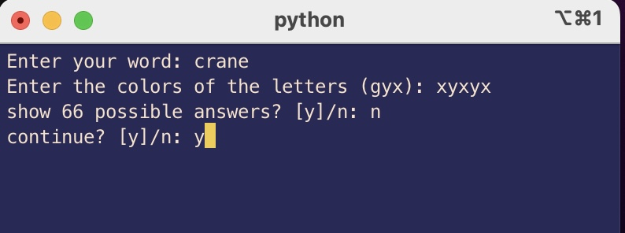
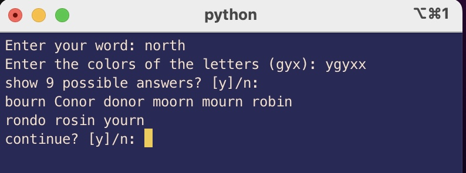
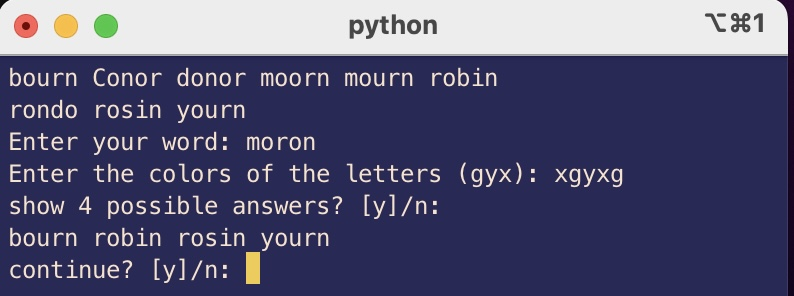
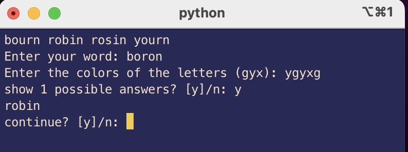

# WordleHelper

## Description
A cli tool to assist your daily wordle game if you need help

## How to Run
`python main.py`  
follow the on screen descirption to filter and show candidate words after your attemps
```g``` is for green ```y``` is for yellow ```x``` is for gray

## Example Screenshots

first attemp 

second attemp 

third attemp 

forth attemp 


## TODO
| Catagory | Description |
| --- | ----------- |
| bug | handle duplicate letters cases better |